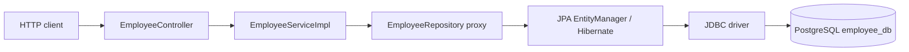
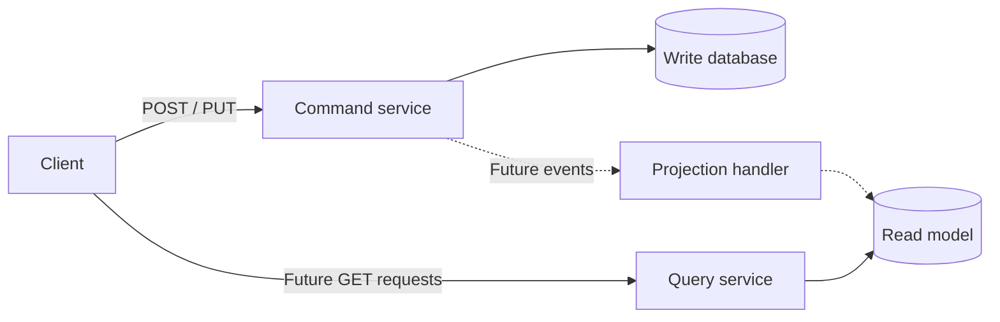

# Employee Command Service — Detailed Study Notes

These notes describe the source code currently in this project. Examples of future improvements are explicitly labelled; they are not implemented features. API outcomes below are derived from the code, not from a live database test.

## Contents

1. [Project purpose and structure](#1-project-purpose-and-structure)
2. [CQRS design pattern](#2-cqrs-design-pattern)
3. [Spring Data JPA and JpaRepository](#3-spring-data-jpa-and-jparepository)
4. [JpaRepository vs CrudRepository](#4-jparepository-vs-crudrepository)
5. [PostgreSQL connection properties](#5-postgresql-connection-properties)
6. [Entity and request model](#6-entity-and-request-model)
7. [Add employee execution flow](#7-add-employee-execution-flow)
8. [Update employee execution flow](#8-update-employee-execution-flow)
9. [Annotations used in this project](#9-annotations-used-in-this-project)
10. [Transactions and error handling](#10-transactions-and-error-handling)
11. [Running and trying the APIs](#11-running-and-trying-the-apis)
12. [Revision questions](#12-revision-questions)

## 1. Project purpose and structure

`employee-command-service` is a Spring Boot REST application that writes employee data to PostgreSQL. Its two business operations are creating an employee and changing an existing employee's email.

| Operation | Endpoint | Implemented behavior |
| --- | --- | --- |
| Add employee | `POST /api/v1/employees` | Saves first name, last name, and email with a generated ID |
| Update employee | `PUT /api/v1/employees/{id}` | Finds the employee and changes **only email** |

There are no GET or DELETE endpoints, query service, message broker, or event publisher in the supplied source.

### Technology configuration

[pom.xml](pom.xml) declares Spring Boot parent version `4.1.1` and Java `17`. Spring Boot dependency management supplies versions for dependencies without explicit versions.

| Dependency | Role here |
| --- | --- |
| `spring-boot-starter-webmvc` | Spring MVC REST request handling and embedded web application support |
| `spring-boot-starter-data-jpa` | Spring Data repositories, JPA integration, and the default Hibernate provider |
| `postgresql` | PostgreSQL JDBC driver; runtime scope makes it available when the application runs |
| `lombok` | Declared and configured as an annotation processor, but no Lombok annotations are used in these classes |
| `spring-boot-starter-data-jpa-test` | JPA-related test support |
| `spring-boot-starter-webmvc-test` | MVC-related test support |

### Source map

All application classes live under `src/main/java/com/durga/employee/`.

| File | Responsibility |
| --- | --- |
| [EmployeeCommandServiceApplication.java](src/main/java/com/durga/employee/EmployeeCommandServiceApplication.java) | Starts Spring Boot |
| [controller/EmployeeController.java](src/main/java/com/durga/employee/controller/EmployeeController.java) | Maps HTTP requests to service calls |
| [dto/EmployeeRequest.java](src/main/java/com/durga/employee/dto/EmployeeRequest.java) | Holds incoming first name, last name, and email |
| [service/EmployeeService.java](src/main/java/com/durga/employee/service/EmployeeService.java) | Defines the two application operations |
| [service/EmployeeServiceImpl.java](src/main/java/com/durga/employee/service/EmployeeServiceImpl.java) | Implements creation and update logic |
| [entity/Employee.java](src/main/java/com/durga/employee/entity/Employee.java) | Maps employee objects to database rows |
| [repository/EmployeeRepository.java](src/main/java/com/durga/employee/repository/EmployeeRepository.java) | Provides inherited JPA persistence methods |
| [application.properties](src/main/resources/application.properties) | Configures PostgreSQL and Hibernate |



The controller handles HTTP concerns, the service expresses the use case, and the repository handles persistence. This separation lets the business logic evolve without putting database code directly into controller methods.

## 2. CQRS design pattern

**CQRS means Command Query Responsibility Segregation.** It separates the model used to change data from the model used to retrieve data. A command expresses a requested change; a query retrieves information without intentionally changing business state. This separation can help when read and write requirements differ substantially, but also adds design complexity. See [Martin Fowler's CQRS explanation](https://martinfowler.com/bliki/CQRS.html).

### Employee use cases

| Command-side examples | Query-side examples |
| --- | --- |
| Register a new employee | Display an employee profile |
| Change an employee's email | Search employees by name |
| Deactivate an employee | Display an employee directory |

Only the first two command examples exist here. The remaining operations illustrate how the application could grow.

### How this project fits

The current application is a foundation for the **write side** of a CQRS system. Its REST controller exposes commands and persists their results in the `employees` table. A service name alone does not establish a complete CQRS architecture: there is no separate read model in this repository.

Calling `findById()` during an update is valid command-side behavior. A command often needs to inspect existing state to enforce rules or determine what to change. CQRS separates business responsibilities; it does not prohibit reads inside write workflows.

A possible future architecture is:



CQRS does not require separate microservices, separate databases, Kafka, or event sourcing. Those are additional choices. If a future design updates a read model asynchronously, users may briefly see older data until the projection catches up. Reliable event delivery and replay handling would then need explicit implementation.

Event sourcing is a different concept: it stores a history of domain events as the source of truth. This project stores the current employee state in ordinary rows; it does not use event sourcing.

For this small application, ordinary layered CRUD is sufficient to implement the existing requirements. CQRS becomes more useful if employee writes require complex rules while reads need different, optimized representations.

## 3. Spring Data JPA and JpaRepository

### The layers are different

| Term | Meaning in this application |
| --- | --- |
| JPA / Jakarta Persistence | Specification for mapping Java objects to relational data and managing their persistence |
| Hibernate | JPA implementation that tracks entities and generates database SQL |
| Spring Data JPA | Repository abstraction that reduces repetitive JPA data-access code |
| JDBC | Java API for communicating with relational databases |
| PostgreSQL JDBC driver | Database-specific implementation that communicates with PostgreSQL |
| PostgreSQL | Database server that stores rows and enforces constraints |

JPA defines the contract; Hibernate implements it. Spring Data JPA provides repository infrastructure above that contract. The project uses the modern `jakarta.persistence` namespace in its entity imports. See the [Spring Data JPA project overview](https://spring.io/projects/spring-data-jpa/).

### Repository declaration

```java
@Repository
public interface EmployeeRepository extends JpaRepository<Employee, Long> {
}
```

`Employee` is the entity type and `Long` is its ID type. Spring creates a repository proxy at startup, backed by JPA repository infrastructure. You therefore do not write an `EmployeeRepositoryImpl` just to use the standard operations.

Methods available through the repository include:

```java
employeeRepository.save(employee);
employeeRepository.findById(id);     // Optional<Employee>
employeeRepository.existsById(id);   // boolean
employeeRepository.findAll();        // List<Employee>
employeeRepository.count();         // long
employeeRepository.deleteById(id);
```

Only `save()` and `findById()` are called by the current service. Repository methods do not automatically create REST endpoints.

### How save decides what to do

For this entity, which has no version field, a null ID identifies a new entity. Spring Data JPA uses `EntityManager.persist()` for a new entity and `merge()` for an entity it considers existing. The newly constructed employee in `addEmployee()` has a null ID; the employee retrieved for update has an existing ID. `merge()` returns a managed instance, which need not be the same Java object as the argument. See [Spring Data JPA entity persistence](https://docs.spring.io/spring-data/jpa/reference/jpa/entity-persistence.html).

SQL execution timing depends on identity generation, flushing, and transaction boundaries. A `save()` call should not be interpreted as a universal promise that exactly one SQL statement runs immediately.

## 4. JpaRepository vs CrudRepository

The correct spelling is **CrudRepository**, not `CurdRepository`. CRUD stands for Create, Read, Update, and Delete.

| Feature | `CrudRepository<T, ID>` | `JpaRepository<T, ID>` |
| --- | --- | --- |
| Module | Spring Data Commons | Spring Data JPA |
| Scope | General repository contract | JPA-specific repository contract |
| Basic CRUD | Yes | Yes, inherited |
| `findById()` return | `Optional<T>` | `Optional<T>` |
| `findAll()` return | `Iterable<T>` | `List<T>` |
| `saveAll()` return | `Iterable<S>` | `List<S>` |
| Paging and sorting | Not supplied by this interface alone | Available through inherited interfaces |
| Explicit flush operations | No | `flush()`, `saveAndFlush()`, `saveAllAndFlush()` |
| JPA bulk deletion helpers | No | Examples include `deleteAllInBatch()` |
| Query by example | Not part of this interface | Available through `QueryByExampleExecutor` |

Sources: [CrudRepository API](https://docs.spring.io/spring-data/commons/docs/current/api/org/springframework/data/repository/CrudRepository.html) and [JpaRepository API](https://docs.spring.io/spring-data/jpa/reference/api/java/org/springframework/data/jpa/repository/JpaRepository.html).

The modern hierarchy has multiple branches:

```text
Repository
  ├── CrudRepository
  │     └── ListCrudRepository ──────────────────┐
  └── PagingAndSortingRepository               │
        └── ListPagingAndSortingRepository ────┤
QueryByExampleExecutor ────────────────────────┤
                                              └── JpaRepository
```

Do not assume that the modern `PagingAndSortingRepository` itself extends `CrudRepository`; `JpaRepository` combines the capabilities through its parent interfaces.

Both interfaces support the two methods currently used by this project. `JpaRepository` additionally makes JPA-specific capabilities available. Extending it does not automatically make queries faster, and `saveAll()` does not by itself guarantee JDBC batching.

**Flush vs commit:** flushing synchronizes pending persistence changes with the database; committing completes the transaction. `saveAndFlush()` does not independently guarantee a commit of an enclosing transaction. Bulk deletion methods also have different persistence-context and lifecycle behavior from deleting entities one by one. See the [JpaRepository method documentation](https://docs.spring.io/spring-data/jpa/reference/api/java/org/springframework/data/jpa/repository/JpaRepository.html).

## 5. PostgreSQL connection properties

The configuration is in [application.properties](src/main/resources/application.properties). The password is represented below by a placeholder instead of duplicating the local credential.

```properties
spring.application.name=employee-command-service

spring.datasource.url=jdbc:postgresql://localhost:5432/employee_db
spring.datasource.username=postgres
spring.datasource.password=<your-local-database-password>
spring.datasource.driver-class-name=org.postgresql.Driver

spring.jpa.database-platform=org.hibernate.dialect.PostgreSQLDialect
spring.jpa.hibernate.ddl-auto=update

spring.jpa.show-sql=true
spring.jpa.properties.hibernate.format_sql=true
```

### Application name

`spring.application.name` identifies the application in Spring configuration and integrations that use its name. It does not create the database, choose an HTTP URL, or change the web server port.

### JDBC URL

`jdbc:postgresql://localhost:5432/employee_db` has these parts:

| Part | Meaning |
| --- | --- |
| `jdbc:` | Java database connection URL prefix |
| `postgresql:` | PostgreSQL driver subprotocol |
| `localhost` | Database host, relative to the machine or container running Java |
| `5432` | PostgreSQL server port |
| `employee_db` | Database to connect to |

The database must already exist. Hibernate table generation does not create the PostgreSQL server or the target database. In containers, `localhost` points to that container, so a separately hosted database normally needs a different hostname. See [pgJDBC connection documentation](https://jdbc.postgresql.org/documentation/use/).

### Username and password

`spring.datasource.username` selects the PostgreSQL login role. Here it is `postgres`. `spring.datasource.password` supplies that role's password. Authentication must also be permitted by PostgreSQL's server configuration.

The role needs permission to connect and access the target schema and tables. With `ddl-auto=update`, it also needs whatever schema-change permissions Hibernate's generated DDL requires.

For an environment-based configuration, a possible future replacement is:

```properties
spring.datasource.url=${DB_URL:jdbc:postgresql://localhost:5432/employee_db}
spring.datasource.username=${DB_USERNAME:postgres}
spring.datasource.password=${DB_PASSWORD}
```

These placeholders are an example, not the current file contents. Alternatively, Spring Boot's standard environment overrides such as `SPRING_DATASOURCE_PASSWORD` can override the existing property without editing the file.

### Driver class

`org.postgresql.Driver` is the JDBC driver implementation supplied by the `postgresql` dependency. It implements communication with the database. Spring Boot can normally infer the driver from the JDBC URL when the dependency is available; this project names it explicitly.

### Hibernate dialect

`org.hibernate.dialect.PostgreSQLDialect` tells Hibernate which SQL dialect to use. The driver handles communication; the dialect handles database-specific SQL generation. Modern Hibernate can generally determine a dialect from JDBC metadata, but this project sets it explicitly.

Spring Boot configures a `DataSource` from the datasource properties, normally using a connection pool with the JPA starter. The application does not manually open and close a new physical connection in each controller method. See [Spring Boot SQL database support](https://docs.spring.io/spring-boot/reference/data/sql.html).

### Schema behavior: ddl-auto

| Value | Effect |
| --- | --- |
| `none` | No Hibernate schema creation or validation |
| `validate` | Check the existing schema against mappings without changing it |
| `update` | Attempt to adjust the schema to match entity mappings |
| `create` | Recreate the schema at startup; existing data can be lost |
| `create-drop` | Create the schema and drop it when the persistence context factory shuts down normally |

The current value is `update`. It can create the `employees` table and apply supported changes after connecting to an existing database. It is not a complete, versioned migration system and should not be assumed to correctly infer renames or every constraint change. A possible deployment improvement is using Flyway or Liquibase with explicit migrations and Hibernate validation. See [Spring Boot database initialization](https://docs.spring.io/spring-boot/how-to/data-initialization.html).

### SQL logging

`spring.jpa.show-sql=true` enables Hibernate SQL output. `spring.jpa.properties.hibernate.format_sql=true` passes the `hibernate.format_sql` setting to Hibernate to make SQL easier to read. Formatting does not change query behavior. SQL output often contains `?` placeholders; these settings alone do not show every bound parameter value.

### Startup sequence

1. `main()` invokes `SpringApplication.run(...)`.
2. Spring discovers configuration and application components.
3. Database auto-configuration builds the datasource using the supplied properties.
4. JPA initializes its entity manager factory and Hibernate reads the entity mapping.
5. Hibernate performs the configured schema action against PostgreSQL.
6. Repository proxies, services, and controllers are wired together, and the web application becomes ready.

This is a conceptual startup sequence; internal bean initialization can interleave. Invalid credentials, an unavailable database, or failed schema setup can prevent startup.

## 6. Entity and request model

### EmployeeRequest: the input DTO

```java
public class EmployeeRequest {
    private String firstName;
    private String lastName;
    private String email;
    // Explicit getters and setters in the source
}
```

A DTO, or Data Transfer Object, defines incoming application data. Spring MVC's configured JSON message converter maps JSON properties onto this object. It has no database mapping annotations and no ID field.

### Employee: the persisted entity

| Java field | Database column | Mapping |
| --- | --- | --- |
| `Long id` | `id` | Primary key, generated using `IDENTITY` |
| `String firstName` | `first_name` | Explicit column name; non-null |
| `String lastName` | `last_name` | Explicit column name; nullable by default |
| `String email` | `email` | Unique constraint requested; nullable by default |

`@Table(name="employees")` selects the table. Because mapping annotations are placed on fields, JPA uses field access. `Employee` has no declared constructor, so Java supplies the no-argument constructor needed here.

`GenerationType.IDENTITY` delegates identifier generation to the database identity mechanism. Clients do not need to send an ID when creating an employee, and generated values need not form a gap-free sequence.

The database constraints are not request validation:

- `nullable=false` rejects null at the database level when the schema reflects the mapping; it does not reject an empty string.
- `unique=true` does not check email syntax.
- PostgreSQL's ordinary unique constraint allows multiple null values. A required email would need a non-null constraint and appropriate application validation.

See [PostgreSQL constraints](https://www.postgresql.org/docs/current/ddl-constraints.html). The actual database schema is authoritative, especially when working with an existing table and automatic schema updates.

Separating DTO and entity prevents the HTTP contract from being tied directly to every persistence field. The service currently maps the fields manually through setters.

## 7. Add employee execution flow

### Request

```http
POST /api/v1/employees
Content-Type: application/json

{
  "firstName": "Anita",
  "lastName": "Rao",
  "email": "anita.rao@example.com"
}
```

### Step-by-step processing

1. The embedded web server receives the request and Spring MVC routes it through `DispatcherServlet`.
2. The class-level `@RequestMapping("/api/v1/employees")` and method-level `@PostMapping` select `EmployeeController.addEmployee(EmployeeRequest)`.
3. `@RequestBody` causes the JSON body to be converted into `EmployeeRequest`.
4. The controller invokes `employeeService.addEmployee(employeeRequest)`.
5. Spring's injected implementation is `EmployeeServiceImpl`.
6. The service creates a new `Employee` and copies email, first name, and last name from the DTO.
7. `employeeRepository.save(employee)` invokes the Spring Data JPA repository proxy.
8. The new entity has a null ID, so persistence follows the new-entity path. Hibernate generates the insert and PostgreSQL generates the ID.
9. Database constraints are checked as the write executes. On success, the repository transaction completes.
10. Both service and controller return `void`. With the current controller and normal Spring MVC handling, the successful HTTP response is **200 OK with an empty body**.

The code does not explicitly send `201 Created`, a `Location` header, or the generated employee ID.

### Service code

```java
Employee employee = new Employee();
employee.setEmail(employeeRequest.getEmail());
employee.setFirstName(employeeRequest.getFirstName());
employee.setLastName(employeeRequest.getLastName());
employeeRepository.save(employee);
```

Conceptually, the database receives an operation like:

```sql
INSERT INTO employees (first_name, last_name, email)
VALUES ('Anita', 'Rao', 'anita.rao@example.com');
```

This SQL illustrates the effect, not the exact statement Hibernate emits. Actual SQL can include identity handling and different column ordering, and uses bound values.

## 8. Update employee execution flow

### Request

```http
PUT /api/v1/employees/1
Content-Type: application/json

{
  "firstName": "Changed name",
  "lastName": "Changed surname",
  "email": "anita.updated@example.com"
}
```

### Step-by-step processing

1. Spring matches `PUT /api/v1/employees/{id}` using `@PutMapping("/{id}")`.
2. `@PathVariable Long id` converts the path segment `1` into a `Long`.
3. `@RequestBody` converts the JSON body into `EmployeeRequest`.
4. The controller calls `employeeService.updateEmployee(id, employeeRequest)`.
5. The service invokes `employeeRepository.findById(id)`, which returns `Optional<Employee>`.
6. If the row exists, `orElseThrow(...)` unwraps the employee. If it does not exist, it throws the current generic `RuntimeException`.
7. The service executes only `employee.setEmail(employeeRequest.getEmail())`.
8. The service saves the employee; JPA synchronizes the resulting state to PostgreSQL.
9. On success, the controller returns **200 OK with an empty body** under normal MVC handling.

### Actual update logic

```java
Employee employee = employeeRepository.findById(id)
    .orElseThrow(() -> new RuntimeException("Employee Not Found wiht id: " + id));

employee.setEmail(employeeRequest.getEmail());
employeeRepository.save(employee);
```

The misspelling `wiht` above is present in the source message. It does not affect exception behavior.

### Before and after

| Field | Before | Value sent | After successful update |
| --- | --- | --- | --- |
| `id` | `1` | Path ID `1` | `1` |
| `firstName` | `Anita` | `Changed name` | `Anita` |
| `lastName` | `Rao` | `Changed surname` | `Rao` |
| `email` | `anita.rao@example.com` | `anita.updated@example.com` | `anita.updated@example.com` |

**First name and last name are ignored by the update implementation.** Sending only an email is enough for its current business logic. Omitting email sets it to null, because there is no presence check or non-null validation.

The logical database effect is:

```sql
SELECT id, first_name, last_name, email FROM employees WHERE id = 1;
UPDATE employees SET email = 'anita.updated@example.com' WHERE id = 1;
```

Actual Hibernate SQL can update additional columns with their existing values and may perform additional reads; the example describes the intended data change, not exact statement count or shape.

The controller's PUT method is also named `addEmployee`, but takes two arguments. Java permits this overload. HTTP routing uses annotations, so the PUT still invokes the update service method. Renaming that controller method to `updateEmployee` would improve readability without changing the route.

As a possible API improvement, an email-specific PATCH endpoint would express a partial change more clearly. Alternatively, a full employee PUT could deliberately replace all editable fields. Neither change is implemented here.

## 9. Annotations used in this project

### Application bootstrap

**`@SpringBootApplication`** — on `EmployeeCommandServiceApplication`.

Combines Spring Boot configuration, auto-configuration, and component scanning. Its package, `com.durga.employee`, is the base for discovering the controller and service in child packages; Boot also uses its auto-configuration package for normal entity and repository discovery. `SpringApplication.run(...)` starts the application context.

### Web annotations

| Annotation | Location | Purpose here |
| --- | --- | --- |
| `@RestController` | `EmployeeController` | Registers a web controller and applies response-body semantics; it combines `@Controller` and `@ResponseBody` behavior |
| `@RequestMapping("/api/v1/employees")` | Controller class | Adds the common route prefix to handler methods |
| `@PostMapping` | One-argument `addEmployee` | Handles POST at the class-level route |
| `@PutMapping("/{id}")` | Two-argument `addEmployee` | Handles PUT with an employee ID in the URL |
| `@RequestBody` | Both DTO parameters | Reads and converts the HTTP request body into `EmployeeRequest` |
| `@PathVariable` | PUT method's `Long id` parameter | Binds and converts the `{id}` path value |

`@RequestBody` does not automatically validate email format or business constraints. The unnamed `@PathVariable` relies on the Java parameter name `id` being available; `@PathVariable("id")` would make that binding explicit.

### Service and repository annotations

**`@Service`** — on `EmployeeServiceImpl`. Marks the class as a service component so Spring can discover and inject it. It does not automatically make the entire service method transactional.

**`@Repository`** — on `EmployeeRepository`. Marks the persistence role. For Spring Data repository interfaces, repository scanning already discovers the interface and creates its proxy, so this annotation is generally optional here. Spring's persistence infrastructure also provides exception translation to the Spring data-access exception hierarchy; the annotation itself does not generate SQL.

**`@Override`** — on the implementation's `addEmployee()` and `updateEmployee()`. This Java annotation lets the compiler verify that each method implements or overrides an inherited method. It is unrelated to Spring bean discovery.

### Persistence annotations

| Annotation | Location | Meaning |
| --- | --- | --- |
| `@Entity` | `Employee` | Declares a JPA-managed persistent entity |
| `@Table(name="employees")` | `Employee` | Selects the database table |
| `@Id` | `id` field | Declares the entity's primary key |
| `@GeneratedValue(strategy=GenerationType.IDENTITY)` | `id` field | Uses a database-generated identity value |
| `@Column(name="first_name", nullable=false)` | `firstName` | Names the column and requests a NOT NULL schema constraint |
| `@Column(name="last_name")` | `lastName` | Names the column; nullability remains at its default |
| `@Column(unique=true)` | `email` | Requests a unique column constraint during schema generation |

`GenerationType.IDENTITY` is an enum value passed to an annotation, not another annotation.

### Test annotations

The test file is [EmployeeCommandServiceApplicationTests.java](src/test/java/com/durga/employee/EmployeeCommandServiceApplicationTests.java).

**`@SpringBootTest`** loads the Spring Boot application context for an integration-style test. With the default web environment it does not start a real listening HTTP server. Because no separate test datasource is configured here, context initialization can still require the configured PostgreSQL database.

**`@Test`**, imported from JUnit Jupiter, identifies `contextLoads()` as a test method. Its empty body checks only that context loading succeeds. It does not verify either API's business behavior.

### Important annotations absent from this code

- No `@Autowired` is needed on these constructors: each component has a single constructor, and Spring injects its dependencies through that constructor.
- No `@Transactional` is declared on the service.
- No `@Valid`, `@NotBlank`, `@NotNull`, or `@Email` validates the request DTO.
- No `@RestControllerAdvice` or `@ExceptionHandler` provides application-specific exception responses.
- No `@Version` field implements optimistic locking.
- No Lombok `@Data`, `@Getter`, or `@Setter` is used; the accessors are written explicitly.

These are observations about the source, not additional features.

## 10. Transactions and error handling

### Repository transactions vs a service transaction

Inherited Spring Data JPA CRUD methods carry default transaction configuration: reads use read-only transaction settings, and writes such as `save()` use a write transaction. However, this project's `updateEmployee()` does not declare a transaction spanning its entire read-modify-save operation. Repository calls therefore do not establish a single service-level atomic unit. See [Spring Data JPA transactionality](https://docs.spring.io/spring-data/jpa/reference/jpa/transactions.html).

Entity attachment between calls can depend on persistence-context configuration, including Open EntityManager in View. An open persistence context is not itself a service-wide database transaction.

A possible future improvement is placing Spring's `@Transactional` on the service update method so its work shares a transaction. In such a transaction, JPA dirty checking can persist changes to a managed entity at flush time. A transaction alone does not prevent every concurrent lost update; an optimistic-locking version field can help detect conflicts. These changes are not present now.

### Expected failure behavior from the current code

| Situation | Current behavior |
| --- | --- |
| Missing employee ID in the database | Generic `RuntimeException`; normally HTTP 500, not a deliberately mapped 404 |
| Non-numeric path ID, such as `/employees/abc` | Path conversion fails; normally HTTP 400 |
| Malformed JSON or missing required request body | MVC rejects the request; normally HTTP 400 |
| POST with missing/null first name | Can fail on the non-null constraint; no DTO validation provides an early, friendly response |
| Duplicate non-null email | Can fail on the unique database constraint; no custom 409 mapping exists |
| Invalid email format | No format validation in the DTO or service |
| PUT without email | Sets email to null if the database allows it |

Database failures are normally surfaced as server errors without custom exception mapping. Exact error response JSON and whether exception messages are exposed depend on Spring Boot error configuration. The source does not define a stable error response contract.

Potential improvements include request validation, a specific not-found exception mapped to 404, a duplicate-email response mapped to 409, and explicit success statuses. These notes document them without changing the application.

## 11. Running and trying the APIs

These instructions are examples for local verification; the commands were not executed as part of writing these notes.

1. Install a JDK compatible with the Java 17 build configuration and ensure PostgreSQL is running.
2. Using a PostgreSQL administration tool, create the database if it does not exist:

   ```sql
   CREATE DATABASE employee_db;
   ```

3. Match the datasource username, password, host, and port to your local server.
4. From the project directory in PowerShell, start the application:

   ```powershell
   .\mvnw.cmd spring-boot:run
   ```

The Maven wrapper can download Maven and dependencies on first use. No `server.port` is set in the supplied properties, so the examples use the normal default of `8080`; external configuration can override it.

### Add an employee with PowerShell

```powershell
$createBody = @{
    firstName = 'Anita'
    lastName = 'Rao'
    email = 'anita.rao@example.com'
} | ConvertTo-Json

Invoke-RestMethod -Method Post `
    -Uri 'http://localhost:8080/api/v1/employees' `
    -ContentType 'application/json' `
    -Body $createBody
```

An empty success response is expected. The generated ID is not returned by the API. Since there is no GET endpoint, inspect the row using a database client connected to `employee_db`:

```sql
SELECT id, first_name, last_name, email
FROM employees
WHERE email = 'anita.rao@example.com';
```

### Update the actual generated ID

Replace `1` with the ID found in the database:

```powershell
$employeeId = 1
$updateBody = @{
    email = 'anita.updated@example.com'
} | ConvertTo-Json

Invoke-RestMethod -Method Put `
    -Uri "http://localhost:8080/api/v1/employees/$employeeId" `
    -ContentType 'application/json' `
    -Body $updateBody
```

Verify that the email changed and the names stayed the same:

```sql
SELECT id, first_name, last_name, email FROM employees WHERE id = 1;
```

Use the actual ID in that SQL too. Repeating the create request with an already stored email can violate the unique constraint.

### Existing test

```powershell
.\mvnw.cmd test
```

The existing test only loads the context. It is not proof that creation, updates, missing IDs, or constraint failures behave correctly. Dedicated integration tests would be needed to verify those cases automatically.

## 12. Revision questions

**Why does the repository interface have no method bodies?**

Spring Data supplies a runtime implementation for inherited repository operations.

**Why is `Long` the second repository type parameter?**

It matches the entity's primary-key Java type.

**Why use a DTO instead of accepting the entity directly?**

The request model defines the API input independently of persistence details such as the generated ID.

**Does `@Service` make a method transactional?**

No. The service currently relies on repository method transactions; it has no explicit transaction covering the complete update.

**Does `save()` always insert?**

No. Spring Data JPA chooses persistence behavior based on whether it considers the entity new.

**Does the update API update all request fields?**

No. Only email is copied to the existing employee.

**Does `@Column(unique=true)` make email mandatory or validate its format?**

No. Uniqueness, nullability, and format validation are separate concerns.

**Does `ddl-auto=update` create `employee_db`?**

No. It operates on the schema after connecting to an existing database.

**Why can a command service call `findById()`?**

A write operation may need current state. That internal read does not create a client-facing query model.

**Is this a complete distributed CQRS implementation?**

No. It implements two command-side HTTP operations backed by a relational database. Separate queries, projections, and event delivery would require additional work.
